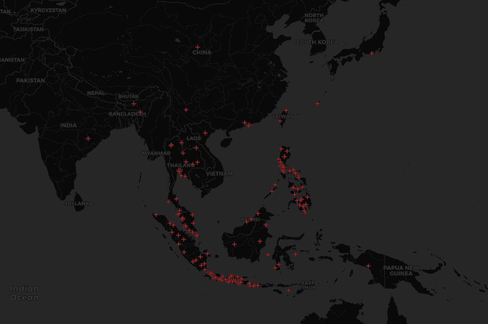

# geog458_lab2

###### The aim of map is to capture tweets posted within the Southeast Asia area. I have set my southwest point to be somewhere in the Indian Ocean and my northeast point to be east of Taiwan. One thing I noticed from my map is how it captured some twitter points outside of the box I have defined. There appeared to be one tweet from Japan and another in the middle of China. I was quite surprised to see a point appearing within the territory of China because Twitter is banned in China. Another observation I have found is most of the tweets were captured within Philippines and Indonesia. I think this is related to how Tweepy collects data in a real time scenario. My data were collected around 8:00p.m PT, this corresponds to 11a.m and 10a.m in Philippines and Indonesia. Compared to other countries these two country stand out the most. I also did some research and found out these two coutries have the largest populations among Southeast Asia countries which also might have been a factor why more data were collected from them.
